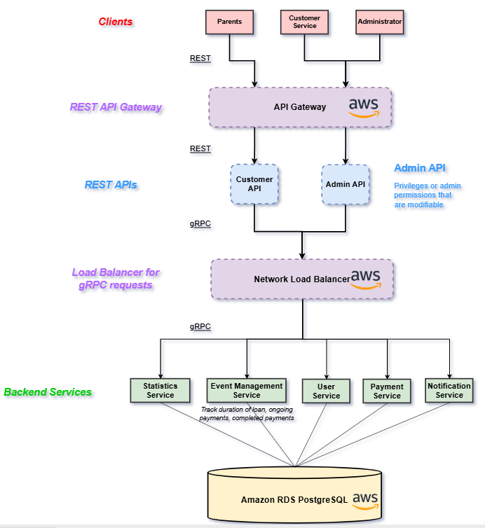
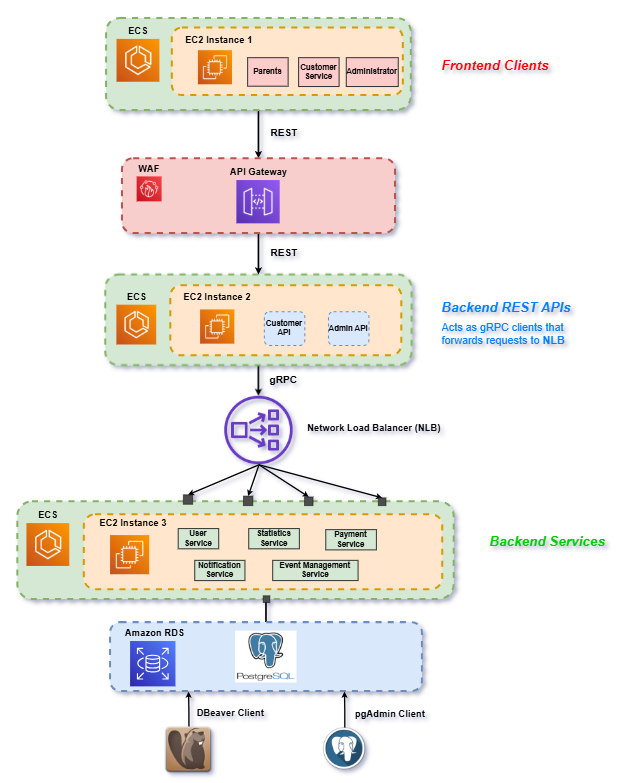
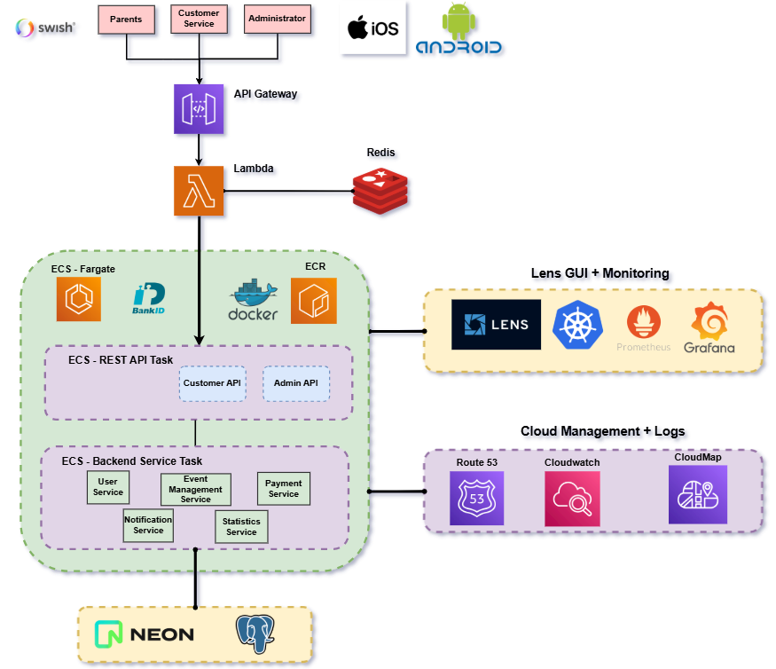
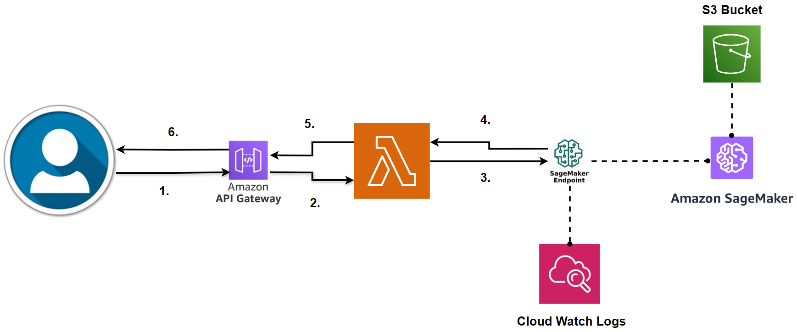
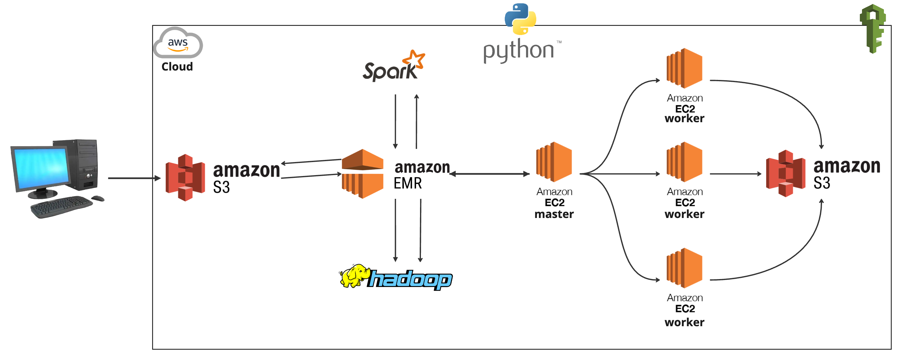
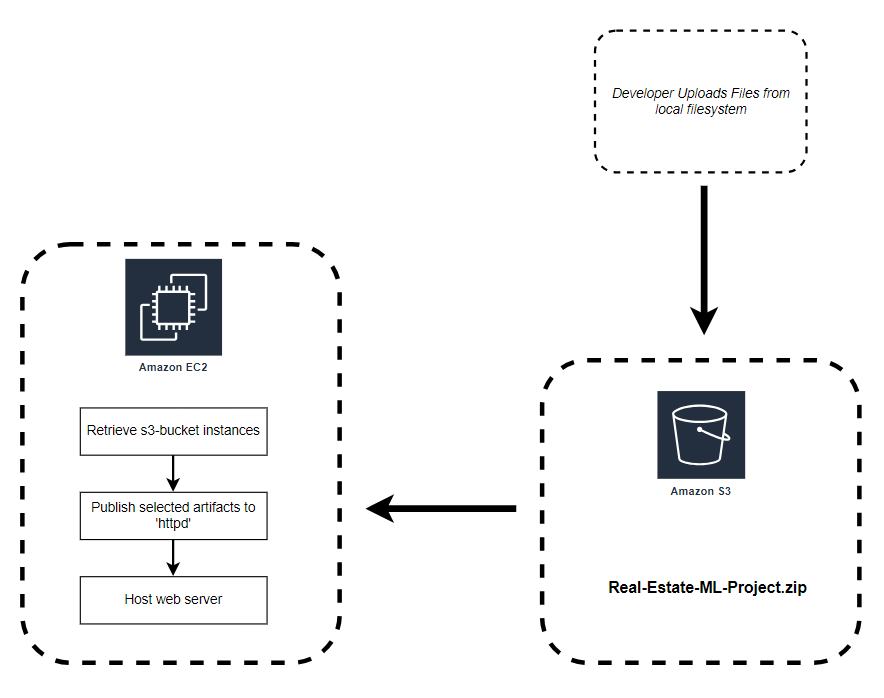

# AWS Architectures

- Table of Contents
  - [Aktiv Framtid](#aktiv-framtid)
    - [Base Architecture](#base-architecture)
    - [Architecture V1](#architecture-v1)
    - [Architecture V2](#architecture-v2)
  - [Individual Projects](#individual-projects)
    - [AWS Sagemaker System](#aws-sagemaker-system)
    - [AWS Big Data System](#aws-big-data-system)
    - [Generative AI Bedrock](#generative-ai-bedrock)
    - [Real-Estate Price Prediction](#real-estate-price-prediction)

## Aktiv Framtid

- Me and a team of 5 other engineers

### Base Architecture

Text

### Architecture V1

Text

### Architecture V2

Text

- Note that **Swish** and **BankID** are two famous payment methods in Sweden

TODO:

Explain how the problem with Application Load Balancer, Route 53, CloudMap and shell scripts solved this issue, using IAM roles to dynamically change the IP of API Gateway as a result of the startup founder's expressed need to cut maintanence costs for AWS

## Individual Projects

### AWS Sagemaker System

**Repository:** https://github.com/mrjex/AWS-Sagemaker-System

### AWS Big Data System

**Repository:** https://github.com/mrjex/AWS-BigData-System

### Generative AI Bedrock

**Repository:** https://github.com/mrjex/AWS-Generative-AI-Endpoint/tree/main

### Real-Estate Price Prediction

**Repository:** https://github.com/mrjex/Real-Estate-Price-Prediction