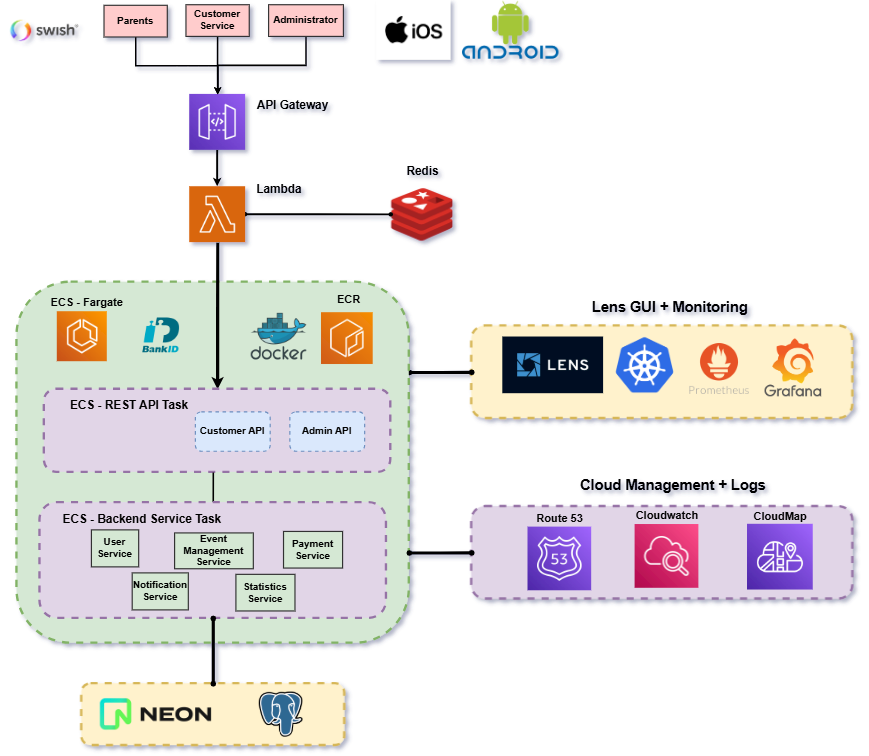

# AWS Architectures

- Table of Contents

## Aktiv Framtid

- Me and a team of 5 other engineers

### Base Architecture

Text

### Architecture V1

Text

### Architecture V2

Text

- Note that **Swish** and **BankID** are two famous payment methods in Sweden

TODO:

Explain how the problem with Application Load Balancer, Route 53, CloudMap and shell scripts solved this issue, using IAM roles to dynamically change the IP of API Gateway as a result of the startup founder's expressed need to cut maintanence costs for AWS

## Individual Projects

Text

### Sagemaker

Text

### Generative AI Bedrock

Text

### Real-Estate Price Prediction

Text

### Big Data Systems

Text