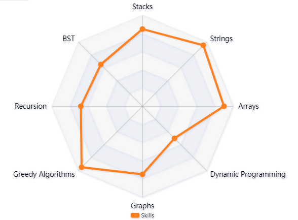
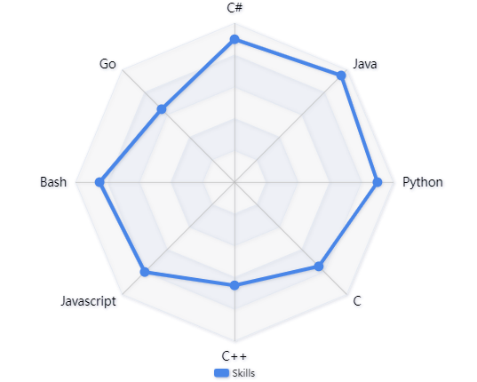

# Joel Mattsson

*A Swedish coder with **6+** years of experience* 

## 📊 Top Languages

All coding projects are built from the ground up, from planning and designing all the way to solving real-life problems at large scales. I'm a full-stack developer that specializes in Software Engineering & Management and has been coding ever since 2019. Below, all of my experiences are briefly summarized in different subsections.

## Table of Contents

- [Joel Mattsson](#joel-mattsson)
  - [📊 Top Languages](#-top-languages)
  - [Table of Contents](#table-of-contents)
  - [🛠️ Languages \& Tools](#️-languages--tools)
- [‎](#)
  - [General Experiences](#general-experiences)
  - [📂 Project Highlights](#-project-highlights)
    - [Data Structures](#data-structures)
    - [Programming Languages](#programming-languages)
    - [Amazon Web Services](#amazon-web-services)
    - [Databases](#databases)
    - [Operating Systems](#operating-systems)
    - [DevOps](#devops)
    - [Data Visualization](#data-visualization)
    - [Artificial Intelligence \& Machine Learning](#artificial-intelligence--machine-learning)
    - [Agile Development](#agile-development)
    - [APIs](#apis)
    - [Documentation](#documentation)
    - [IDEs](#ides)
  - [Other Experiences](#other-experiences)
    - [Other Programming Concepts Covered](#other-programming-concepts-covered)
      - [Object Oriented Programming](#object-oriented-programming)
      - [Software Design Principles](#software-design-principles)
      - [Software Testing and Quality Assurance](#software-testing-and-quality-assurance)
      - [Software Development Lifecycles](#software-development-lifecycles)

## 🛠️ Languages & Tools

  
  
  
  
  
  
  
  
  

  
  
  
  
  
  
  
  

  
  
  
  
  
  
  
  

  
  
  
  
  
  
  
  

  
  
  

# ‎ 

<!-- BEGIN YOUTUBE_CARDS -->
   
<!-- END YOUTUBE_CARDS -->

## General Experiences

In a very broad and brief way, my experience gained throughout the years are summed up in a few categories to give you a quick overall view to understand my abilities. All of the corresponding projects are linked to the related directory to showcase the functionality in the particular knowledge domain presented in this read-me file.

## 📂 Project Highlights

TODO

### Data Structures

During all of my invested time in online sites such as *AlgoExpert* and *Hackerrank*, I cultivated a theoretical and practical familiarity with data structures in [Problem Solving](https://gitlab.com/jex-projects/mrjex/-/tree/main/problem-solving?ref_type=heads). Later on I attended [Data Structures & Algorithms](https://gitlab.com/jex-projects/mrjex/-/tree/main/projects/1.%20courses/year-1/5.%20Data%20Structures%20&%20Algorithms?ref_type=heads) and became more knowledgeable in the field. Eventually, I identified the opportunity of using a priority que combined with a max heap in [Distributed Systems, Clinic Service]() to reduce the time complexity of the operations in the microservice architecture. Keeping all of this in mind, I made the following self-assessment of my proficiencies:

### Programming Languages

I made the following evalaution of my programming language skills due to my track record demonstrated below:

- **Python** *during summer 2022 and 2024*

    - **60+ problems solved** in [AlgoExpert Repository](https://gitlab.com/jex-projects/mrjex/-/tree/main/problem-solving/2.%20AlgoExpert?ref_type=heads)
    - [Project Branno](https://gitlab.com/jex-projects/mrjex/-/tree/main/projects/2.%20spare-time/1.%20Project%20Branno?ref_type=heads)
    - [Relational Analysis & Visualization](https://gitlab.com/jex-projects/mrjex/-/tree/main/projects/2.%20spare-time/2.%20Relational-Analysis-And-Visualization?ref_type=heads)
    - [Product Demand Prediction](https://gitlab.com/jex-projects/mrjex/-/tree/main/projects/2.%20spare-time/3.%20Product-Demand-Prediction?ref_type=heads)
    - [Real Estate Price Prediction](https://gitlab.com/jex-projects/mrjex/-/tree/main/projects/2.%20spare-time/4.%20Real-Estate-Price-Prediction?ref_type=heads)
    - [Real-Time Data Capture Streaming](https://gitlab.com/jex-projects/mrjex/-/tree/main/projects/2.%20spare-time/5.%20Realtime%20Change%20Data%20Capture%20Streaming?ref_type=heads)
    - [Global City Streaming](https://gitlab.com/jex-projects/mrjex/-/tree/main/projects/2.%20spare-time/6.%20City%20Streaming%20Project?ref_type=heads)
    - [Sagemaker AWS Prediction](https://gitlab.com/jex-projects/mrjex/-/tree/main/projects/2.%20spare-time/8.%20Sagemaker%20AWS%20Prediction?ref_type=heads)
    - [AWS BigData Project](https://gitlab.com/jex-projects/mrjex/-/tree/main/projects/2.%20spare-time/10.%20AWS%20BigData%20Project?ref_type=heads)
    - [AWS Bedrock Generative AI](https://gitlab.com/jex-projects/mrjex/-/tree/main/projects/2.%20spare-time/11.%20AWS%20Bedrock%20Generative%20AI?ref_type=heads)
    - [Foundations of Artificial Intelligence](https://gitlab.com/jex-projects/mrjex/-/tree/main/projects/1.%20courses/year-3/1.%20Exchange%20Studies%20Venice/1.%20Foundations%20of%20Artificial%20Intelligence?ref_type=heads)
    - [Foundations of Machine Learning](https://gitlab.com/jex-projects/mrjex/-/tree/main/projects/1.%20courses/year-3/1.%20Exchange%20Studies%20Venice/2.%20Foundations%20of%20Machine%20Learning?ref_type=heads)
    - [Computer Programming & Data Management - 1](https://gitlab.com/jex-projects/mrjex/-/tree/main/projects/1.%20courses/year-3/1.%20Exchange%20Studies%20Venice/3.%20Computer%20Programming%20&%20Datamanagement%20-%201?ref_type=heads)
    - [Computer Programming & Data Management - 2](https://gitlab.com/jex-projects/mrjex/-/tree/main/projects/1.%20courses/year-3/1.%20Exchange%20Studies%20Venice/4.%20Computer%20Programming%20&%20Datamanagement%20-%202?ref_type=heads)
    - [Data Science & Business Intelligence](https://gitlab.com/jex-projects/mrjex/-/tree/main/projects/1.%20courses/year-3/1.%20Exchange%20Studies%20Venice/5.%20Data%20Science%20&%20Business%20Intelligence?ref_type=heads)

- **C#** *and Unity for 3 years (2019-2022)*

    - **20+ problems solved** in [C-Sharp Programming Repository](https://gitlab.com/jex-projects/mrjex/-/tree/main/problem-solving/1.%20C-Sharp-Programming?ref_type=heads)
    - [Breadth First Search](https://gitlab.com/jex-projects/mrjex/-/tree/main/problem-solving/2.%20AlgoExpert/Executionary%20Code/Graphs/BreadthFirstSearch?ref_type=heads)
    - [Depth First Search](https://gitlab.com/jex-projects/mrjex/-/tree/main/problem-solving/2.%20AlgoExpert/Executionary%20Code/Graphs/DepthFirstSearch?ref_type=heads)
    - [SingleCycleCheck](https://gitlab.com/jex-projects/mrjex/-/tree/main/problem-solving/2.%20AlgoExpert/Executionary%20Code/Graphs/SingleCycleCheck?ref_type=heads)
  
- **Java** *for multiple courses (2022-2023)*

    - [Object Oriented Programming](https://gitlab.com/jex-projects/mrjex/-/tree/main/projects/1.%20courses/year-1/1.%20Object%20Oriented%20Programming?ref_type=heads)
    - [Team Programming & Management](https://gitlab.com/jex-projects/mrjex/-/tree/main/projects/1.%20courses/year-1/3.%20Team%20Programming%20&%20Management?ref_type=heads)
    - [Data Structures & Algorithms](https://gitlab.com/jex-projects/mrjex/-/tree/main/projects/1.%20courses/year-1/5.%20Data%20Structures%20&%20Algorithms?ref_type=heads)
    - [Systems Development, AndroidApp & NoteParser](https://gitlab.com/jex-projects/mrjex/-/tree/main/projects/1.%20courses/year-1/7.%20Systems%20Development?ref_type=heads)
    - [Software Analysis Construction, Assignment 3 & 4](https://gitlab.com/jex-projects/mrjex/-/tree/main/projects/1.%20courses/year-1/8.%20Software%20Analysis%20Construction?ref_type=heads)
    - [Fundamentals of Software Architecture, Assignment 4: Microservices](https://gitlab.com/jex-projects/mrjex/-/tree/main/projects/1.%20courses/year-2/2.%20Fundamentals%20of%20Software%20Architecture/Assignment%204%20-%20Architectural%20Styles%20and%20their%20Applications/Code-Submission/microservices?ref_type=heads)
    - [Global City Streaming](https://gitlab.com/jex-projects/mrjex/-/tree/main/projects/2.%20spare-time/6.%20City%20Streaming%20Project?ref_type=heads)
    - [Distributed Systems, Clinic Service](https://gitlab.com/jex-projects/mrjex/-/tree/main/projects/1.%20courses/year-2/3.%20Distributed%20Systems/dentanoid-project/3.%20services/clinic-service?ref_type=heads)
    - [Software Quality & Testing, Assignment 2 - Unit & Structural Testing](https://gitlab.com/jex-projects/mrjex/-/tree/main/projects/1.%20courses/year-2/6.%20Software%20Quality%20%26%20Testing/Assignment%202%20-%20Unit%20and%20Structural%20Testing?ref_type=heads)

- **Javascript** *in two courses (4 months in total)*

    - [Real Estate Price Prediction](https://gitlab.com/jex-projects/mrjex/-/tree/main/projects/2.%20spare-time/4.%20Real-Estate-Price-Prediction?ref_type=heads)
    - [Web Development](https://gitlab.com/jex-projects/mrjex/-/tree/main/projects/1.%20courses/year-2/1.%20Web%20Development?ref_type=heads)
    - [Fundamentals of Software Architecture, Assignment 4: Web-Services](https://gitlab.com/jex-projects/mrjex/-/tree/main/projects/1.%20courses/year-2/2.%20Fundamentals%20of%20Software%20Architecture/Assignment%204%20-%20Architectural%20Styles%20and%20their%20Applications/Code-Submission/web-services?ref_type=heads)
    - [Distributed Systems: Dentist Client](https://gitlab.com/jex-projects/mrjex/-/tree/main/projects/1.%20courses/year-2/3.%20Distributed%20Systems/dentanoid-project/1.%20clients/dentist-client?ref_type=heads)
    - [Distributed Systems: Patient Client](https://gitlab.com/jex-projects/mrjex/-/tree/main/projects/1.%20courses/year-2/3.%20Distributed%20Systems/dentanoid-project/1.%20clients/patient-client?ref_type=heads)
    - [Distributed Systems: Dentist API](https://gitlab.com/jex-projects/mrjex/-/tree/main/projects/1.%20courses/year-2/3.%20Distributed%20Systems/dentanoid-project/2.%20apis/dentist-api?ref_type=heads)
    - [Distributed Systems: Patient API](https://gitlab.com/jex-projects/mrjex/-/tree/main/projects/1.%20courses/year-2/3.%20Distributed%20Systems/dentanoid-project/2.%20apis/patient-api?ref_type=heads)
    - [Distributed Systems: Notification Service](https://gitlab.com/jex-projects/mrjex/-/tree/main/projects/1.%20courses/year-2/3.%20Distributed%20Systems/dentanoid-project/3.%20services/notification-service?ref_type=heads)

- **Go** *in one course partially (equivalent to 1 month)*

    - [Distributed Systems: Appointment Service](https://gitlab.com/jex-projects/mrjex/-/tree/main/projects/1.%20courses/year-2/3.%20Distributed%20Systems/dentanoid-project/3.%20services/appointment-service?ref_type=heads)
    - [Distributed Systems: User Service](https://gitlab.com/jex-projects/mrjex/-/tree/main/projects/1.%20courses/year-2/3.%20Distributed%20Systems/dentanoid-project/3.%20services/user-service?ref_type=heads)
    - [Distributed Systems: Monitor Service](https://gitlab.com/jex-projects/mrjex/-/tree/main/projects/1.%20courses/year-2/3.%20Distributed%20Systems/dentanoid-project/3.%20services/monitoring-service?ref_type=heads)

- **C** *in one intensive course with many assignments*

    - [Development of Embedded & Real-Time Systems, Tinkerad Assignments](https://gitlab.com/jex-projects/mrjex/-/tree/main/projects/1.%20courses/year-2/5.%20Development%20of%20Embedded%20%26%20Real-Time%20Systems?ref_type=heads)

- **C++** *in four courses*

    - [Systems Development, Wio-Terminal Component](https://gitlab.com/jex-projects/mrjex/-/tree/main/projects/1.%20courses/year-1/7.%20Systems%20Development/WioPlay/seeed-wio-terminal?ref_type=heads)
    - [Fundamentals of Software Architecture, Assignment 4: Pipe-And-Filter](https://gitlab.com/jex-projects/mrjex/-/tree/main/projects/1.%20courses/year-2/2.%20Fundamentals%20of%20Software%20Architecture/Assignment%204%20-%20Architectural%20Styles%20and%20their%20Applications/Code-Submission/pipe-and-filter?ref_type=heads)
    - [Development of Embedded & Real-Time Systems, Tinkerad Assignments](https://gitlab.com/jex-projects/mrjex/-/tree/main/projects/1.%20courses/year-2/5.%20Development%20of%20Embedded%20%26%20Real-Time%20Systems?ref_type=heads)
    - [Cyber Physical Systems and Sytems of Systems](https://gitlab.com/jex-projects/mrjex/-/tree/main/projects/1.%20courses/year-2/7.%20Cyber%20Physical%20Systems%20and%20Sytems%20of%20Systems/project/src?ref_type=heads)

- **Bash** *in one course and in many summer 2024 projects*

    - [Cyber Physical Systems and Sytems of Systems](https://gitlab.com/jex-projects/mrjex/-/tree/main/projects/1.%20courses/year-2/7.%20Cyber%20Physical%20Systems%20and%20Sytems%20of%20Systems/project/src?ref_type=heads)
    - [Project Branno](https://gitlab.com/jex-projects/mrjex/-/tree/main/projects/2.%20spare-time/1.%20Project%20Branno?ref_type=heads)
    - [Relational Analysis & Visualization](https://gitlab.com/jex-projects/mrjex/-/tree/main/projects/2.%20spare-time/2.%20Relational-Analysis-And-Visualization?ref_type=heads)
    - [Global City Streaming](https://gitlab.com/jex-projects/mrjex/-/tree/main/projects/2.%20spare-time/6.%20City%20Streaming%20Project?ref_type=heads)
    - [Kubernetes Learning](https://gitlab.com/jex-projects/mrjex/-/tree/main/projects/2.%20spare-time/7.%20Kubernetes%20Learning?ref_type=heads)
    - [Sagemaker AWS Prediction](https://gitlab.com/jex-projects/mrjex/-/tree/main/projects/2.%20spare-time/8.%20Sagemaker%20AWS%20Prediction?ref_type=heads)
    - [AWS BigData Project](https://gitlab.com/jex-projects/mrjex/-/tree/main/projects/2.%20spare-time/10.%20AWS%20BigData%20Project?ref_type=heads)
    - [AWS Bedrock Generative AI](https://gitlab.com/jex-projects/mrjex/-/tree/main/projects/2.%20spare-time/11.%20AWS%20Bedrock%20Generative%20AI?ref_type=heads)
    - [AlgoExpert Test Automation](https://gitlab.com/jex-projects/mrjex/-/tree/main/problem-solving/2.%20AlgoExpert?ref_type=heads)

### Amazon Web Services

In the summer of 2024 I integrated AWS in some of my projects, and I ended up working with the following services:

- **Bedrock:**
    - [AWS Bedrock Generative AI](https://gitlab.com/jex-projects/mrjex/-/tree/main/projects/2.%20spare-time/11.%20AWS%20Bedrock%20Generative%20AI?ref_type=heads)

- **EC2:**
    - [AWS BigData Project](https://gitlab.com/jex-projects/mrjex/-/tree/main/projects/2.%20spare-time/10.%20AWS%20BigData%20Project?ref_type=heads)
    - [Real Estate Price Prediction](https://gitlab.com/jex-projects/mrjex/-/tree/main/projects/2.%20spare-time/4.%20Real-Estate-Price-Prediction?ref_type=heads)

- **Sagemaker:**
    - [Sagemaker AWS Prediction](https://gitlab.com/jex-projects/mrjex/-/tree/main/projects/2.%20spare-time/8.%20Sagemaker%20AWS%20Prediction?ref_type=heads)

- **ECR:**
    - [Kubernetes Learning, Project 4](https://gitlab.com/jex-projects/mrjex/-/tree/main/projects/2.%20spare-time/7.%20Kubernetes%20Learning/project-4-eks?ref_type=heads)

- **EMR:**
    - [AWS BigData Project](https://gitlab.com/jex-projects/mrjex/-/tree/main/projects/2.%20spare-time/10.%20AWS%20BigData%20Project?ref_type=heads)

- **EKS:**
    - [Kubernetes Learning, Project 4](https://gitlab.com/jex-projects/mrjex/-/tree/main/projects/2.%20spare-time/7.%20Kubernetes%20Learning/project-4-eks?ref_type=heads)

- **S3:**
    - [AWS BigData Project](https://gitlab.com/jex-projects/mrjex/-/tree/main/projects/2.%20spare-time/10.%20AWS%20BigData%20Project?ref_type=heads)
    - [Real Estate Price Prediction](https://gitlab.com/jex-projects/mrjex/-/tree/main/projects/2.%20spare-time/4.%20Real-Estate-Price-Prediction?ref_type=heads)
    - [AWS Sagemaker Prediction](https://gitlab.com/jex-projects/mrjex/-/tree/main/projects/2.%20spare-time/8.%20Sagemaker%20AWS%20Prediction?ref_type=heads)
    - [AWS Bedrock Generative AI](https://gitlab.com/jex-projects/mrjex/-/tree/main/projects/2.%20spare-time/11.%20AWS%20Bedrock%20Generative%20AI?ref_type=heads)

- **API Gateway:**
    - [AWS Bedrock Generative AI](https://gitlab.com/jex-projects/mrjex/-/tree/main/projects/2.%20spare-time/11.%20AWS%20Bedrock%20Generative%20AI?ref_type=heads)
    - [AWS Sagemaker Prediction](https://gitlab.com/jex-projects/mrjex/-/tree/main/projects/2.%20spare-time/8.%20Sagemaker%20AWS%20Prediction?ref_type=heads)

- **Lambda:**
    - [AWS Sagemaker Prediction](https://gitlab.com/jex-projects/mrjex/-/tree/main/projects/2.%20spare-time/8.%20Sagemaker%20AWS%20Prediction?ref_type=heads)
    - [AWS Bedrock Generative AI](https://gitlab.com/jex-projects/mrjex/-/tree/main/projects/2.%20spare-time/11.%20AWS%20Bedrock%20Generative%20AI?ref_type=heads)

It's worth noting that in the development procedures of most services I used **CloudWatch** to monitor the logs and solve errors I encountered along the way. **Cloud9** and **CodeCommit** was also used to simulate an environment similar to a verison control system like *Git*.

### Databases

- **MongoDB:**
    - [Web Development](https://gitlab.com/jex-projects/mrjex/-/tree/main/projects/1.%20courses/year-2/1.%20Web%20Development?ref_type=heads)
    - [Distributed Systems](https://gitlab.com/jex-projects/mrjex/-/tree/main/projects/1.%20courses/year-2/3.%20Distributed%20Systems?ref_type=heads)
    - [Project Branno](https://gitlab.com/jex-projects/mrjex/-/tree/main/projects/2.%20spare-time/1.%20Project%20Branno?ref_type=heads)

- **PostgresSQL:**
    - [Real-Time Data Capture Streaming](https://gitlab.com/jex-projects/mrjex/-/tree/main/projects/2.%20spare-time/5.%20Realtime%20Change%20Data%20Capture%20Streaming?ref_type=heads)
    - [Global City Streaming](https://gitlab.com/jex-projects/mrjex/-/tree/main/projects/2.%20spare-time/6.%20City%20Streaming%20Project?ref_type=heads)

- **MySQL:**
    - [Tableau Visualization](https://gitlab.com/jex-projects/mrjex/-/tree/main/projects/2.%20spare-time/9.%20Tableau-Visualization?ref_type=heads)
    - [Kubernetes Learning, Project 5 - SQL](https://gitlab.com/jex-projects/mrjex/-/tree/main/projects/2.%20spare-time/7.%20Kubernetes%20Learning/project-5-sql?ref_type=heads)

- **MongoCompass:**
    - [Data Management, Assignment 4](https://gitlab.com/jex-projects/mrjex/-/tree/main/projects/1.%20courses/year-1/6.%20Data%20Management/Assignment%204%20-%20MongoDB?ref_type=heads)

- **Local JSON files:**
    - [Team Programming & Management](https://gitlab.com/jex-projects/mrjex/-/tree/main/projects/1.%20courses/year-1/3.%20Team%20Programming%20&%20Management?ref_type=heads)
    - [Global City Streaming, Debug API, Database](https://gitlab.com/jex-projects/mrjex/-/tree/main/projects/2.%20spare-time/6.%20City%20Streaming%20Project/debug-api/apis/database?ref_type=heads)

### Operating Systems

- **Windows, Powershell CLI & Command Prompt:** Used in all projects except for the ones in the categories mentioned below

- **Ubuntu via WSL CLI and Virtual Box:**
    - [Cyber Physical Systems and Systems of Systems](https://gitlab.com/jex-projects/mrjex/-/tree/main/projects/1.%20courses/year-2/7.%20Cyber%20Physical%20Systems%20and%20Sytems%20of%20Systems?ref_type=heads)
    - [Project Branno](https://gitlab.com/jex-projects/mrjex/-/tree/main/projects/2.%20spare-time/1.%20Project%20Branno?ref_type=heads)
    - [Relational Analysis & Visualization](https://gitlab.com/jex-projects/mrjex/-/tree/main/projects/2.%20spare-time/2.%20Relational-Analysis-And-Visualization?ref_type=heads)
    - [Real Estate Price Prediction](https://gitlab.com/jex-projects/mrjex/-/tree/main/projects/2.%20spare-time/4.%20Real-Estate-Price-Prediction?ref_type=heads)
    - [Real-Time Data Capture Streaming](https://gitlab.com/jex-projects/mrjex/-/tree/main/projects/2.%20spare-time/5.%20Realtime%20Change%20Data%20Capture%20Streaming?ref_type=heads)
    - [Global City Streaming](https://gitlab.com/jex-projects/mrjex/-/tree/main/projects/2.%20spare-time/6.%20City%20Streaming%20Project?ref_type=heads)
    - [Kubernetes Learning](https://gitlab.com/jex-projects/mrjex/-/tree/main/projects/2.%20spare-time/7.%20Kubernetes%20Learning?ref_type=heads)
    - [AWS BigData Project](https://gitlab.com/jex-projects/mrjex/-/tree/main/projects/2.%20spare-time/10.%20AWS%20BigData%20Project?ref_type=heads)

- **Amazon Linux:**
    - [Real Estate Price Prediction](https://gitlab.com/jex-projects/mrjex/-/tree/main/projects/2.%20spare-time/4.%20Real-Estate-Price-Prediction?ref_type=heads) through the *Cloud Shell* to manage *AWS EC2 instances*

### DevOps

- [Cyber Physical Systems of Systems](https://gitlab.com/jex-projects/mrjex/-/blob/main/projects/1.%20courses/year-2/7.%20Cyber%20Physical%20Systems%20and%20Sytems%20of%20Systems/project/.gitlab-ci.yml?ref_type=heads): *A comprehensive CI/CD that supports different platform architectures, that creates a docker image and runs the container to plot performance metrics generarated from the running application, and compares it to the performance of the previous commit*
- [Systems Development](https://gitlab.com/jex-projects/mrjex/-/blob/main/projects/1.%20courses/year-1/7.%20Systems%20Development/WioPlay/.gitlab-ci.yml?ref_type=heads): *Runs multiple components with their associated tests using Maven image as part of the CI/CD pipeline*
- [Distributed Systems](https://gitlab.com/jex-projects/mrjex/-/tree/main/projects/1.%20courses/year-2/3.%20Distributed%20Systems?ref_type=heads): *Contains **9 different CI/CD pipelines**, one for each deployed component in the microservices architecture:*
  - **Microservices:**
    - [Appointment Service](https://gitlab.com/jex-projects/mrjex/-/blob/main/projects/1.%20courses/year-2/3.%20Distributed%20Systems/dentanoid-project/3.%20services/appointment-service/.gitlab-ci.yml?ref_type=heads)
    - [Clinic Service](https://gitlab.com/jex-projects/mrjex/-/blob/main/projects/1.%20courses/year-2/3.%20Distributed%20Systems/dentanoid-project/3.%20services/clinic-service/.gitlab-ci.yml?ref_type=heads)
    - [Monitoring Service](https://gitlab.com/jex-projects/mrjex/-/tree/main/projects/1.%20courses/year-2/3.%20Distributed%20Systems/dentanoid-project/3.%20services/monitoring-service?ref_type=heads)
    - [Notification Service](https://gitlab.com/jex-projects/mrjex/-/blob/main/projects/1.%20courses/year-2/3.%20Distributed%20Systems/dentanoid-project/3.%20services/notification-service/.gitlab-ci.yml?ref_type=heads)
    - [User Service](https://gitlab.com/jex-projects/mrjex/-/blob/main/projects/1.%20courses/year-2/3.%20Distributed%20Systems/dentanoid-project/3.%20services/user-service/.gitlab-ci.yml?ref_type=heads)
  - **Clients:**
    - [Paitent Client](https://gitlab.com/jex-projects/mrjex/-/blob/main/projects/1.%20courses/year-2/3.%20Distributed%20Systems/dentanoid-project/1.%20clients/patient-client/.gitlab-ci.yml?ref_type=heads)
    - [Dentist Client](https://gitlab.com/jex-projects/mrjex/-/tree/main/projects/1.%20courses/year-2/3.%20Distributed%20Systems/dentanoid-project/1.%20clients/dentist-client?ref_type=heads)
  - **APIs:**
    - [Patient API](https://gitlab.com/jex-projects/mrjex/-/blob/main/projects/1.%20courses/year-2/3.%20Distributed%20Systems/dentanoid-project/2.%20apis/patient-api/.gitlab-ci.yml?ref_type=heads)
    - [Dentist API](https://gitlab.com/jex-projects/mrjex/-/blob/main/projects/1.%20courses/year-2/3.%20Distributed%20Systems/dentanoid-project/2.%20apis/dentist-api/.gitlab-ci.yml?ref_type=heads)

- [Sagemaker AWS Prediction](https://gitlab.com/jex-projects/mrjex/-/tree/main/projects/2.%20spare-time/8.%20Sagemaker%20AWS%20Prediction?ref_type=heads)

- [Global City Streaming, Automated Executionary Bash Scripts](https://gitlab.com/jex-projects/mrjex/-/tree/main/projects/2.%20spare-time/6.%20City%20Streaming%20Project/instructions-executions/executionary?ref_type=heads)

- [Relational Analysis and Visualization, Entry Bash Script](https://gitlab.com/jex-projects/mrjex/-/tree/main/projects/2.%20spare-time/2.%20Relational-Analysis-And-Visualization?ref_type=heads)

### Data Visualization

- [Computer Programming and Data Management - 2](https://gitlab.com/jex-projects/mrjex/-/tree/main/projects/1.%20courses/year-3/1.%20Exchange%20Studies%20Venice/4.%20Computer%20Programming%20&%20Datamanagement%20-%202?ref_type=heads)
- [Data Science & Business Intelligence](https://gitlab.com/jex-projects/mrjex/-/tree/main/projects/1.%20courses/year-3/1.%20Exchange%20Studies%20Venice/5.%20Data%20Science%20&%20Business%20Intelligence?ref_type=heads)
- [Tableau Visualization](https://gitlab.com/jex-projects/mrjex/-/tree/main/projects/2.%20spare-time/9.%20Tableau-Visualization?ref_type=heads)
- [Global City Streaming](https://gitlab.com/jex-projects/mrjex/-/tree/main/projects/2.%20spare-time/6.%20City%20Streaming%20Project?ref_type=heads)
- [Product Demand Prediction](https://gitlab.com/jex-projects/mrjex/-/tree/main/projects/2.%20spare-time/3.%20Product-Demand-Prediction?ref_type=heads)
- [Cyber Physical Systems of Systems](https://gitlab.com/jex-projects/mrjex/-/tree/main/projects/1.%20courses/year-2/7.%20Cyber%20Physical%20Systems%20and%20Sytems%20of%20Systems?ref_type=heads)
- [Web Development](https://gitlab.com/jex-projects/mrjex/-/tree/main/projects/1.%20courses/year-2/1.%20Web%20Development?ref_type=heads)
- [Relational Analysis & Visualization](https://gitlab.com/jex-projects/mrjex/-/tree/main/projects/2.%20spare-time/2.%20Relational-Analysis-And-Visualization?ref_type=heads)
- [Real-time Data Capture Streaming](https://gitlab.com/jex-projects/mrjex/-/tree/main/projects/2.%20spare-time/5.%20Realtime%20Change%20Data%20Capture%20Streaming?ref_type=heads)

### Artificial Intelligence & Machine Learning

- [Foundations of Artificial Intelligence](https://gitlab.com/jex-projects/mrjex/-/tree/main/projects/1.%20courses/year-3/1.%20Exchange%20Studies%20Venice/1.%20Foundations%20of%20Artificial%20Intelligence?ref_type=heads)
- [Foundations of Machine Learning](https://gitlab.com/jex-projects/mrjex/-/tree/main/projects/1.%20courses/year-3/1.%20Exchange%20Studies%20Venice/2.%20Foundations%20of%20Machine%20Learning?ref_type=heads)
- [Data Science & Business Intelligence](https://gitlab.com/jex-projects/mrjex/-/tree/main/projects/1.%20courses/year-3/1.%20Exchange%20Studies%20Venice/5.%20Data%20Science%20&%20Business%20Intelligence?ref_type=heads)
- [Project Branno](https://gitlab.com/jex-projects/mrjex/-/tree/main/projects/2.%20spare-time/1.%20Project%20Branno?ref_type=heads)
- [Real Estate Price Prediction](https://gitlab.com/jex-projects/mrjex/-/tree/main/projects/2.%20spare-time/4.%20Real-Estate-Price-Prediction?ref_type=heads)
- [Sagemaker AWS Prediction](https://gitlab.com/jex-projects/mrjex/-/tree/main/projects/2.%20spare-time/8.%20Sagemaker%20AWS%20Prediction?ref_type=heads)
- [Product Demand Prediction](https://gitlab.com/jex-projects/mrjex/-/tree/main/projects/2.%20spare-time/3.%20Product-Demand-Prediction?ref_type=heads)
- [AWS Bedrock Generative AI](https://gitlab.com/jex-projects/mrjex/-/tree/main/projects/2.%20spare-time/11.%20AWS%20Bedrock%20Generative%20AI?ref_type=heads)
- [Relational Analysis & Visualization](https://gitlab.com/jex-projects/mrjex/-/tree/main/projects/2.%20spare-time/2.%20Relational-Analysis-And-Visualization?ref_type=heads)

### Agile Development

- [Team Programming & Management](https://gitlab.com/jex-projects/mrjex/-/tree/main/projects/1.%20courses/year-1/3.%20Team%20Programming%20&%20Management?ref_type=heads)
- [Data Structures & Algorithms](https://gitlab.com/jex-projects/mrjex/-/tree/main/projects/1.%20courses/year-1/5.%20Data%20Structures%20&%20Algorithms?ref_type=heads)
- [Systems Development](https://gitlab.com/jex-projects/mrjex/-/tree/main/projects/1.%20courses/year-1/7.%20Systems%20Development?ref_type=heads)
- [Software Analysis & Construction](https://gitlab.com/jex-projects/mrjex/-/tree/main/projects/1.%20courses/year-1/8.%20Software%20Analysis%20Construction?ref_type=heads)
- [Software Development Methodologies](https://gitlab.com/jex-projects/mrjex/-/tree/main/projects/1.%20courses/year-2/4.%20Software%20Development%20Methodologies?ref_type=heads)
- [Web Development](https://gitlab.com/jex-projects/mrjex/-/tree/main/projects/1.%20courses/year-2/1.%20Web%20Development?ref_type=heads)
- [Distributed Systems](https://gitlab.com/jex-projects/mrjex/-/tree/main/projects/1.%20courses/year-2/3.%20Distributed%20Systems?ref_type=heads)

### APIs

- [Web Development](https://gitlab.com/jex-projects/mrjex/-/tree/main/projects/1.%20courses/year-2/1.%20Web%20Development?ref_type=heads)
- [Fundamentals of Software Architecture, Assignment 4](https://gitlab.com/jex-projects/mrjex/-/tree/main/projects/1.%20courses/year-2/2.%20Fundamentals%20of%20Software%20Architecture/Assignment%204%20-%20Architectural%20Styles%20and%20their%20Applications?ref_type=heads)
- [Sagemaker AWS Prediction](https://gitlab.com/jex-projects/mrjex/-/tree/main/projects/2.%20spare-time/8.%20Sagemaker%20AWS%20Prediction?ref_type=heads)
- [Software Quality & Testing](https://gitlab.com/jex-projects/mrjex/-/tree/main/projects/1.%20courses/year-2/6.%20Software%20Quality%20%26%20Testing?ref_type=heads)
- [Global City Streaming](https://gitlab.com/jex-projects/mrjex/-/tree/main/projects/2.%20spare-time/6.%20City%20Streaming%20Project?ref_type=heads)
- [AWS Bedrock Generative AI](https://gitlab.com/jex-projects/mrjex/-/tree/main/projects/2.%20spare-time/11.%20AWS%20Bedrock%20Generative%20AI?ref_type=heads)
- [Distributed Systems, Patient API](https://gitlab.com/jex-projects/mrjex/-/tree/main/projects/1.%20courses/year-2/3.%20Distributed%20Systems/dentanoid-project/2.%20apis/patient-api?ref_type=heads)
- [Distributed Systems, Dentist API](https://gitlab.com/jex-projects/mrjex/-/tree/main/projects/1.%20courses/year-2/3.%20Distributed%20Systems/dentanoid-project/2.%20apis/dentist-api?ref_type=heads)
- [Systems Development](https://gitlab.com/jex-projects/mrjex/-/tree/main/projects/1.%20courses/year-1/7.%20Systems%20Development?ref_type=heads)
[Real Estate Price Prediction](https://gitlab.com/jex-projects/mrjex/-/tree/main/projects/2.%20spare-time/4.%20Real-Estate-Price-Prediction?ref_type=heads)

### Documentation

- [Global City Streaming](https://gitlab.com/jex-projects/mrjex/-/tree/main/projects/2.%20spare-time/6.%20City%20Streaming%20Project?ref_type=heads)
- [Systems Development](https://gitlab.com/jex-projects/mrjex/-/tree/main/projects/1.%20courses/year-1/7.%20Systems%20Development?ref_type=heads)
- [Distributed Systems](https://gitlab.com/jex-projects/mrjex/-/tree/main/projects/1.%20courses/year-2/3.%20Distributed%20Systems?ref_type=heads)
- [Data Science & Business Intelligence](https://gitlab.com/jex-projects/mrjex/-/tree/main/projects/1.%20courses/year-3/1.%20Exchange%20Studies%20Venice/5.%20Data%20Science%20&%20Business%20Intelligence?ref_type=heads)
- [Project Branno](https://gitlab.com/jex-projects/mrjex/-/tree/main/projects/2.%20spare-time/1.%20Project%20Branno?ref_type=heads)
- [Tableau Visualization](https://gitlab.com/jex-projects/mrjex/-/tree/main/projects/2.%20spare-time/9.%20Tableau-Visualization?ref_type=heads)
- [Cyber Physical Systems of Systems](https://gitlab.com/jex-projects/mrjex/-/tree/main/projects/1.%20courses/year-2/7.%20Cyber%20Physical%20Systems%20and%20Sytems%20of%20Systems?ref_type=heads)

### IDEs

Below I list many of the IDEs I've been using since my coding journey started in 2019:

- *Google Cloud Platform's shell console & Google Platform's Cloud Shell Editor*

- *OnlineGdb.com (online C compiler), DataGrip & PyCharm*

- *Cloud9 AWS IDE & AWS Management Console Shell*

- *IntelliJ, VSCode & Visual Studio 2019 Community*

- *GitLab File Editor & Github File Editor*

- *Snowflake, Replit, Jupyter Lab*

## Other Experiences

- Worked as a *Software backend architecture engineer for the startup enterprise AktivFramtid* **(2025)**

- Was one of the *Embassadors for University of Gothenburg*. In particular the company that hosted an event in Italy where I presented my University to other students is *EUTOPIA*, which has an [Instagram](https://www.instagram.com/EutopiaUni/) account and a [Website](https://eutopia-university.eu/) **(2024-2025)**

- For more information about this event, navigate to the [Eutopia Collaboration](https://gitlab.com/jex-projects/mrjex/-/tree/main/projects/1.%20courses/year-3/1.%20Exchange%20Studies%20Venice/eutopia-presentation?ref_type=heads) directory

- Worked at *Svensk Direkt Reklam (SDR)* **(2017-2018)**

### Other Programming Concepts Covered

These general software engineering concepts provide a comprehensive foundation for building, maintaining, and delivering high-quality software. They encompass a range of practices from planning, designing, and coding to testing, deploying, and maintaining applications effectively. Mastering these concepts is essential for producing reliable, scalable, and user-friendly software solutions

#### Object Oriented Programming

OOP is a paradigm that organizes code around objects, which are instances of classes. Classes define the blueprint for creating objects, specifying attributes (properties) and methods (behaviors). Key principles of OOP include:
- **Encapsulation:** Bundling data and methods together to restrict direct access to some of an object's components.
- **Abstraction:** Hiding complex implementation details to focus on simpler high-level interactions.
- **Inheritance:** Allowing new classes to inherit properties and methods from existing classes.
- **Polymorphism:** Enabling functions or methods to work in different ways based on input or context.

SOLID Principles help in designing systems that are easy to understand, flexible, and maintainable:
- **Single Responsibility:** Each class should have one responsibility.
- **Open-Closed:** Classes should be open for extension but closed for modification.
- **Liskov Substitution:** Derived classes should be substitutable for their base classes.
- **Interface Segregation:** Many small, specific interfaces are better than a single general-purpose one.
- **Dependency Inversion:** High-level modules should not depend on low-level modules directly.

Related experiences:
- [Object Oriented Programming](https://gitlab.com/jex-projects/mrjex/-/tree/main/projects/1.%20courses/year-1/1.%20Object%20Oriented%20Programming?ref_type=heads)
- [Software Analysis & Construction, Asteroids](https://gitlab.com/jex-projects/mrjex/-/tree/main/projects/1.%20courses/year-1/8.%20Software%20Analysis%20Construction/Assignment%204%20-%20Architecture%20Refactoring%20%26%20Consistency?ref_type=heads)
- [Distributed Systems, Clinic Service](https://gitlab.com/jex-projects/mrjex/-/tree/main/projects/1.%20courses/year-2/3.%20Distributed%20Systems/dentanoid-project/3.%20services/clinic-service?ref_type=heads)

#### Software Design Principles

Software Design is about planning the structure of the software before actual coding begins. My related experiences include:

- [Software Analysis & Construction](https://gitlab.com/jex-projects/mrjex/-/tree/main/projects/1.%20courses/year-1/8.%20Software%20Analysis%20Construction?ref_type=heads)
- [Systems Development](https://gitlab.com/jex-projects/mrjex/-/tree/main/projects/1.%20courses/year-1/7.%20Systems%20Development?ref_type=heads)
- [Development of Embedded & Real-Time Systems](https://gitlab.com/jex-projects/mrjex/-/tree/main/projects/1.%20courses/year-2/5.%20Development%20of%20Embedded%20&%20Real-Time%20Systems?ref_type=heads)
- [Cyber Physical Systems of Systems](https://gitlab.com/jex-projects/mrjex/-/tree/main/projects/1.%20courses/year-2/7.%20Cyber%20Physical%20Systems%20and%20Sytems%20of%20Systems?ref_type=heads)
- [Foundations of Artificial Intelligence](https://gitlab.com/jex-projects/mrjex/-/tree/main/projects/1.%20courses/year-3/1.%20Exchange%20Studies%20Venice/1.%20Foundations%20of%20Artificial%20Intelligence?ref_type=heads)

#### Software Testing and Quality Assurance

Testing is vital for verifying that software meets requirements and performs as expected. It includes:

- **Unit Testing:** Testing individual components or functions:
  - [Distributed Systems, Clinic Service](https://gitlab.com/jex-projects/mrjex/-/tree/main/projects/1.%20courses/year-2/3.%20Distributed%20Systems/dentanoid-project/3.%20services/clinic-service?ref_type=heads)
  - [Software Quality & Testing, Assignment 2](https://gitlab.com/jex-projects/mrjex/-/tree/main/projects/1.%20courses/year-2/6.%20Software%20Quality%20&%20Testing/Assignment%202%20-%20Unit%20and%20Structural%20Testing?ref_type=heads)

- **Integration Testing:** Ensuring different modules work together:
  - [Distributed Systems, Patient API](https://gitlab.com/jex-projects/mrjex/-/tree/main/projects/1.%20courses/year-2/3.%20Distributed%20Systems/dentanoid-project/2.%20apis/patient-api?ref_type=heads)
  - [Distributed Systems, Dentist API](https://gitlab.com/jex-projects/mrjex/-/tree/main/projects/1.%20courses/year-2/3.%20Distributed%20Systems/dentanoid-project/2.%20apis/dentist-api?ref_type=heads)
  - [Software Quality & Testing, Assignment 1](https://gitlab.com/jex-projects/mrjex/-/tree/main/projects/1.%20courses/year-2/6.%20Software%20Quality%20&%20Testing/Assignment%201%20-%20Quality%20and%20System%20Testing?ref_type=heads)

- **System Testing:** Testing the complete system as a whole:
  - [Cyber Physical Systems of Systems](https://gitlab.com/jex-projects/mrjex/-/tree/main/projects/1.%20courses/year-2/7.%20Cyber%20Physical%20Systems%20and%20Sytems%20of%20Systems?ref_type=heads)
  - [Software Quality & Testing, Assignment 3](https://gitlab.com/jex-projects/mrjex/-/tree/main/projects/1.%20courses/year-2/6.%20Software%20Quality%20&%20Testing/Assignment%203%20-%20Mutation%20Testing%20and%20Finite-State%20Verification?ref_type=heads)

- **Acceptance Testing:** Validating the software against user needs:
  - [Systems Development, Wikipage Requirements](https://gitlab.com/jex-projects/mrjex/-/tree/main/projects/1.%20courses/year-1/7.%20Systems%20Development/WikiPages/Requirements?ref_type=heads)
  - [Distributed Systems, Wikipage Requirements](https://gitlab.com/jex-projects/mrjex/-/blob/main/projects/1.%20courses/year-2/3.%20Distributed%20Systems/Wiki%20Pages/Home/User-stories.md?ref_type=heads)

#### Software Development Lifecycles

A Software Development Life Cycle is the process of planning, creating, testing, and deploying software. It includes stages such as:

- **Requirements Gathering and Analysis:** *Understanding what the user needs*

  - [Requirements & User Experience](https://gitlab.com/jex-projects/mrjex/-/tree/main/projects/1.%20courses/year-1/4.%20Requirements%20&%20User%20Experience?ref_type=heads)
  - [Research Methods in Software Engineering](https://gitlab.com/jex-projects/mrjex/-/tree/main/projects/1.%20courses/year-3/2.%20Middle%20Courses/1.%20Research%20methods%20in%20Software%20Engeering?ref_type=heads)
  - [Software Development Methodologies](https://gitlab.com/jex-projects/mrjex/-/tree/main/projects/1.%20courses/year-2/4.%20Software%20Development%20Methodologies?ref_type=heads)

- **Design:** *Architecting and structuring the software solution*

  - [Data Management](https://gitlab.com/jex-projects/mrjex/-/tree/main/projects/1.%20courses/year-1/6.%20Data%20Management?ref_type=heads)
  - [Software Analysis & Construction](https://gitlab.com/jex-projects/mrjex/-/tree/main/projects/1.%20courses/year-1/8.%20Software%20Analysis%20Construction?ref_type=heads)

- **Implementation:** *Writing and developing the code*

  - [Team Programming & Management](https://gitlab.com/jex-projects/mrjex/-/tree/main/projects/1.%20courses/year-1/3.%20Team%20Programming%20&%20Management?ref_type=heads)
  - [Computer Programming & Data Management - 2](https://gitlab.com/jex-projects/mrjex/-/tree/main/projects/1.%20courses/year-3/1.%20Exchange%20Studies%20Venice/4.%20Computer%20Programming%20&%20Datamanagement%20-%202?ref_type=heads)

- **Testing:** *Ensuring the software meets quality standards and is bug-free*

  - [Software Quality & Testing](https://gitlab.com/jex-projects/mrjex/-/tree/main/projects/1.%20courses/year-2/6.%20Software%20Quality%20&%20Testing?ref_type=heads)
  - [Object Oriented Programming](https://gitlab.com/jex-projects/mrjex/-/tree/main/projects/1.%20courses/year-1/1.%20Object%20Oriented%20Programming?ref_type=heads)

- **Deployment:** *Releasing the software for use*

  - [Distributed Systems](https://gitlab.com/jex-projects/mrjex/-/tree/main/projects/1.%20courses/year-2/3.%20Distributed%20Systems?ref_type=heads)
  - [Cyber Physical Systems of Systems](https://gitlab.com/jex-projects/mrjex/-/tree/main/projects/1.%20courses/year-2/7.%20Cyber%20Physical%20Systems%20and%20Sytems%20of%20Systems?ref_type=heads)

- **Maintenance:** *Providing updates and fixing issues as they arise*

  - [Startups and Industrial Software Product Management](https://gitlab.com/jex-projects/mrjex/-/tree/main/projects/1.%20courses/year-3/2.%20Middle%20Courses/2.%20Startups%20and%20Industrial%20Software%20Product%20Management?ref_type=heads)
  - [Data Science & Business Intelligence](https://gitlab.com/jex-projects/mrjex/-/tree/main/projects/1.%20courses/year-3/1.%20Exchange%20Studies%20Venice/5.%20Data%20Science%20&%20Business%20Intelligence?ref_type=heads)